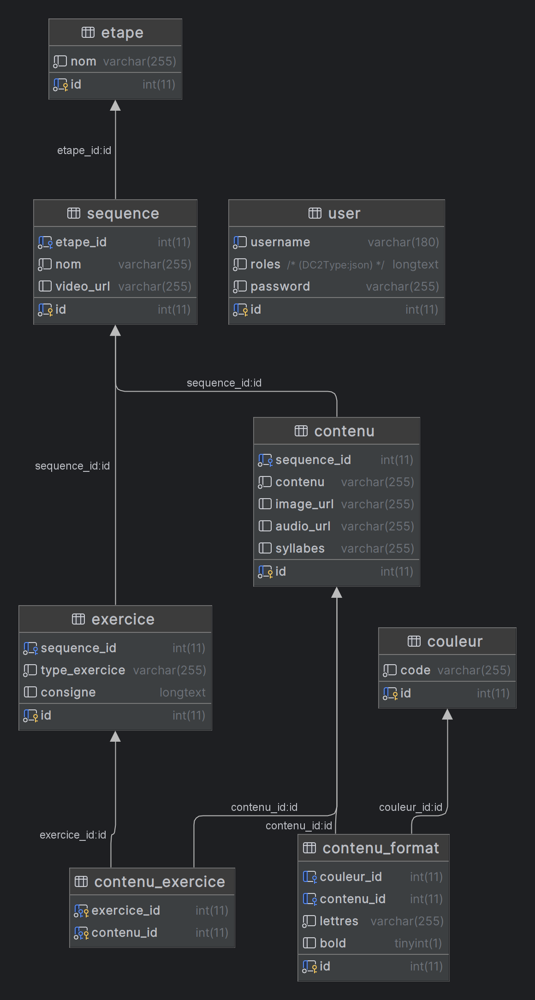
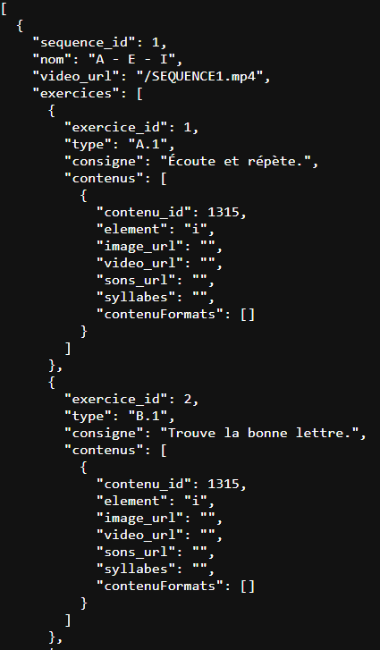
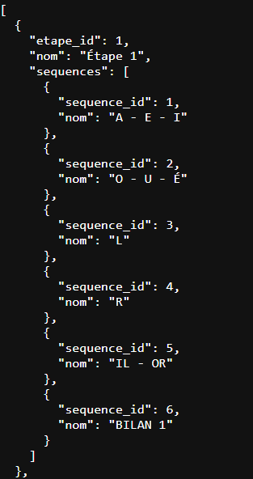

- [x] [Environnement de développement](#lenvironnement-de-d%C3%A9velopement-)
- [x] [Front](#front-)
    - Dépendances principales
    - Dépendances de développement
    - Structure du projet

- [Back](#back-)
    - [Structure de la BDD](#sgbdr-système-de-gestion-de-base-de-données-relationnelle-)
    - Dépendances principales
    - Dépendances de développement
    - APIs


### __L'environnement de dévelopement__ : 

#### Si vous souhaitez installer la stack de développment complète :

- Détails de la stack docker à  : https://gitlab.univ-lr.fr/ntrugeon/docker-symfony-wp-2024, [(tutoriel)](https://gitlab.univ-lr.fr/ntrugeon/docker-symfony-wp-2024/-/blob/main/doc/MACHINEPERSOWINDOWS.md) 


#### Si vous souhaitez uniquement le compose.yaml :

[compose.yaml](readmeRessources/compose.yaml)

#### Front :

##### React 18.3.1 avec Vite


###### Dépendances principales
- [**React**](https://fr.react.dev/)
- [**ReactDOM**](https://fr.react.dev/reference/react-dom)
- [**React Router DOM**](https://reactrouter.com/)
- [**Framer Motion**](https://motion.dev/)
- [**@react-pdf/renderer**](https://react-pdf.org/)
- [**dotenv**](https://www.npmjs.com/package/dotenv)

###### Dépendances de développement
- [**@vitejs/plugin-react**](https://www.npmjs.com/package/@vitejs/plugin-react)
- [**TailwindCSS**](https://tailwindcss.com/docs/installation/using-vite)
- [**Sass**](https://sass-lang.com/documentation/)
- [**PostCSS**](https://postcss.org/docs/)
- [**Autoprefixer**](https://www.npmjs.com/package/autoprefixer)
- [**ESLint**](https://eslint.org/)
- [**@eslint/js**](https://www.npmjs.com/package/@eslint/js)
- [**eslint-plugin-react**](https://www.npmjs.com/package/eslint-plugin-react)
- [**eslint-plugin-react-hooks**](https://www.npmjs.com/package/eslint-plugin-react-hooks)
- [**eslint-plugin-react-refresh**](https://www.npmjs.com/package/eslint-plugin-react-refresh)
- [**@types/react**](https://www.npmjs.com/package/@types/react)
- [**@types/react-dom**](https://www.npmjs.com/package/@types/react-dom)
- [**React Error Overlay**](https://www.npmjs.com/package/react-error-overlay)
- [**Globals**](https://www.npmjs.com/package/globals)
- [**Vite**](https://vite.dev/guide/)

###### Structure du projet

```
+---src
|   |   App.jsx <!-- Fichier de rendu principal-->
|   |   index.css 
|   |   main.jsx
|   |
|   +---api
|   |       alphabet.json
|   |       exercice.json
|   |       graphèmes.json
|   |       sequence.json
|   |
|   +---assets
|   |   +---fonts
|   |   |       BelleAllureGS-Fin.otf
|   |   |       Cursive.ttf
|   |   |       Helvetica.woff
|   |   |
|   |   +---images
|   |   |       (images de l'interface ici…)
|   |   |
|   |   +---sons
|   |   |   +---apprentissage
|   |   |   |       error-sound.mp3
|   |   |   |       reward-sound.mp3
|   |   |   |
|   |   |   \---graphemes
|   |   |           an.mp3
|   |   |           au.mp3
|   |   |           eu.mp3
|   |   |           ...
|   |   |
|   |   \---videos
|   |           a-e-i.mp4
|   |           favicon.ico
|   |           l.mp4
|   |           ...
|   |
|   +---components
|   |       Consigne.jsx
|   |       Header.jsx
|   |       Sidebar.jsx
|   |       ...
|   |
|   |
|   +---hooks
|   |   |   useSpeak.js
|   |   |
|   |   \---api
|   |           useDataEtapes.js
|   |           useDataExercice.js
|   |
|   |
|   +---pages
|   |       Layout.jsx <!-- Fichier de rendu des exercices. C'est ce fichier qui passe les données à un exercice selon son type et qui gère la navigation entre les pages ainsi que le stockage de la progression de session.-->
|   |
|   |       AlphabetPage.jsx
|   |       Credits.jsx
|   |       EtapesPage.jsx
|   |       ...
|   |
|   \---scss
|       |   main.scss
|       |
|       +---base
|       |       _base.scss
|       |       _fonts.scss
|       |       ...
|       |
|       +---components
|       |       _accordion.scss
|       |       _buttons.scss
|       |       ...
|       |
|       \---pages
|               _alphabetPage.scss
|               _etapesPage.scss
|               ...
|
+---public
        favicon.ico
        index.html
        logo192.png
        logo512.png
        manifest.json
        robots.txt


```
---

#### Back :

##### SGBDR (Système de Gestion de Base de Données Relationnelle) : 

MariaDB 10.11.8

##### Schéma relationnel :


##### Symfony 7.1.8

###### Bundles utilisés :

###### Bundles activés dans tous les environnements
- [**FrameworkBundle**](https://symfony.com/components/Framework%20Bundle)
- [**TwigBundle**](https://symfony.com/components/Twig%20Bundle)
- [**SecurityBundle**](https://symfony.com/doc/current/security.html)
- [**DoctrineBundle**](https://symfony.com/bundles/DoctrineBundle/current/index.html)
- [**DoctrineMigrationsBundle**](https://symfony.com/bundles/DoctrineMigrationsBundle/current/index.html)
- [**NelmioCorsBundle**](https://symfony.com/bundles/NelmioCorsBundle/current/index.html)
- [**ApiPlatformBundle**](https://api-platform.com/docs/v2.1/core/getting-started/)
- [**EasyAdminBundle**](https://symfony.com/bundles/EasyAdminBundle/current/index.html)
- [**TwigExtraBundle**](https://github.com/twigphp/twig-extra-bundle)
- [**TwigComponentBundle**](https://symfony.com/bundles/ux-twig-component/current/index.html)
- [**StimulusBundle**](https://symfony.com/bundles/StimulusBundle/current/index.html)
- [**ChartjsBundle**](https://symfony.com/bundles/ux-chartjs/current/index.html)

###### Bundles activés en développement (`dev`)
- [**MakerBundle**](https://symfony.com/bundles/SymfonyMakerBundle/current/index.html)
- [**WebProfilerBundle**](https://symfony.com/components/WebProfiler%20Bundle)
- [**DoctrineFixturesBundle**](https://symfony.com/bundles/DoctrineFixturesBundle/current/index.html)

###### Bundles activés en développement et test (`dev`, `test`)
- [**WebProfilerBundle**](https://symfony.com/components/WebProfiler%20Bundle)
- [**DoctrineFixturesBundle**](https://symfony.com/bundles/DoctrineFixturesBundle/current/index.html)


#### APIs

- api/custom/sequences

Ce endpoint regroupe plusieurs données, c'est celui qui est le plus utilisé.

On y récupère le nom de la séquence et la vidéo liée à cette séquence. 

Ensuite dans cette séquence on récupère les exercices liés à cette séquence, leur type et consigne. 

Pour finir on récupère les contenus liés à cette exercice, l'élément (qui est en fait le contenu), l'url de l'image (qui est stockée dans le dossier /public/images), la video url (qui est stockée dans le dossier /public/videos), le son url (qui est stocké dans le dossier /public/audios), les syllabes (qui sont principalement utilisées pour le type d'exercice C.2bis, H et E.2bis) et pour finir le contenu format qui désigne si le contenu possède une couleur ou du gras. 

Pour récupérer une séquence en particulier on peut utiliser la route /api/custom/sequences/{id}, l'id représente l'id de la séquence.

Le tout au format suivant :
 
 

- api/custom/etapes

Ce endpoint permet de récupérer toutes les étapes et les séquences liées aux étapes depuis la base de données au format suivant :




