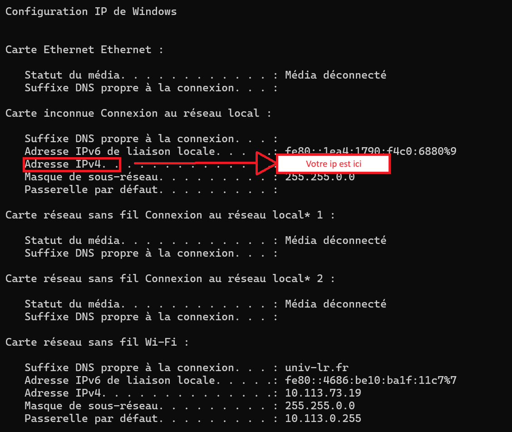
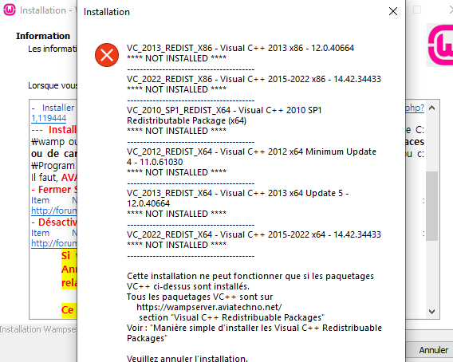
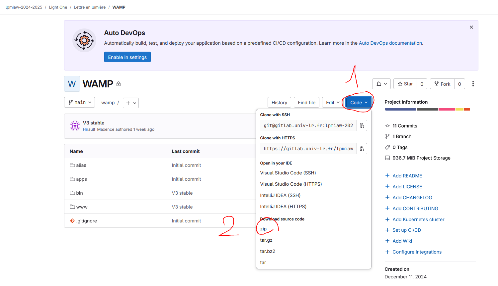
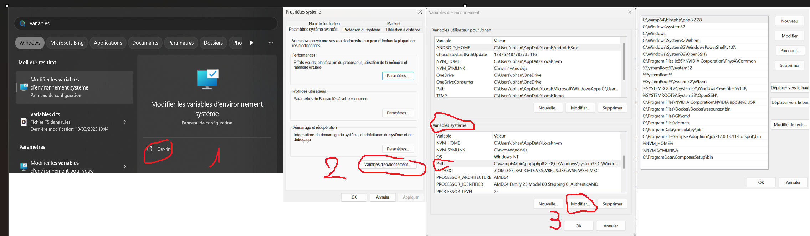
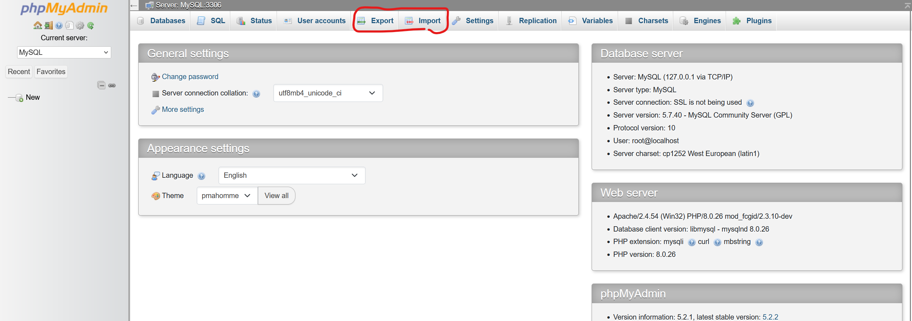

# Documentation du projet

## Sommaire :

1. Tuto utilisateur :
    - [x] Setup
        -  [Environnement d'utilisation](#environnement-dutilisation-)
        -  [Guide d'installation](#guide-dinstallation-)
        -  [Troubleshooting](#troubleshooting)

    -  [x] [Gestion des contenus](#partage-des-contenus-)
        - [Insertion manuelle de nouveaux contenus](#insertion-manuelle-de-nouveaux-contenus-)
        - [Exporter ses contenus](#partage-des-contenus-)
        - [Importer des contenus](#partage-des-contenus-)
        - [Remédier à la perte des contenus](#partage-des-contenus-)

            

--- 

### __Tuto utilisateur__ :

#### Environnement d'utilisation :

 - **Système d'exploitation** : Windows 11
 - **Navigateur supporté :** [Edge](https://support.microsoft.com/fr-fr/microsoft-edge/t%C3%A9l%C3%A9charger-le-nouveau-microsoft-edge-bas%C3%A9-sur-chromium-0f4a3dd7-55df-60f5-739f-00010dba52cf)
 - **Lien d'accès** si WAMP est installé sur chaque pc : http://localhost/
 - **Lien d'accès** si les pc sont connectés en réseau sur la machine ayant installé WAMP : 
    1. Rendez-vous sur le pc hôte de WAMP, appuyez sur <kbd>⊞ Win</kbd> + <kbd>R</kbd>
    2. Tappez `cmd` puis appuez sur <kbd>Entrée</kbd>
    3. Vous êtes maintenant dans la console, tappez `ipconfig` puis <kbd>Entrée</kbd>
    4. Notez la valeur de l'adresse **IPv4**
    
    5. Avec les pc utilisateurs connectés au pc serveur, rendez vous à http:/**la valeur de votre IPv4**/

#### Guide d'installation :

 1. Installer [WAMP](https://www.wampserver.com/) dans sa version x64

 2. Si ce genre de message apparaît pendant l'installation, pas de panique, installez simplement les distributions de Visual C++ indiquées depuis le site de Wamp à https://wampserver.aviatechno.net/ **section Visual C++ Redistributable Packages**.

 

 3. **Téléchargez** et **décompressez** le contenu du dépôt git à `https://github.com/Maxencedevweb/Wamp_lel`. Pour décompresser un dossier.zip vous pouvez utiliser [7zip](https://www.7-zip.org/).

 

 4. Rendez vous à `C:\wamp64\www` et placez-y le dossier lel que vous
venez de télécharger.

 5. Lancez le serveur **WAMP** en double cliquant sur  wampserver.exe dans C:/Wamp 

 6. Lancez `create_data.bat` dans C:/wamp/www/lel/ (double clique)

 7. **Votre serveur est prêt !** Votre base de données accessible à http://localhost/phpmyadmin/ sous l'utilisateur root - Mot de passe vide - Choix du serveur MariaDB.

#### 🛠️Troubleshooting🛠️
Si vous rencontrez des problèmes, notamment relatifs au chargement des contenus, ceux-ci peuvent résulter de plusieurs cause.

- Tout d'abord assurez vous d'utiliser le navigateur Edge, si ce n'était pas le cas, lancez le projet avec et vérifiez le chargement des étapes à `localhost/etapes` ou l'accès au site.    
- Une version Php trop datée : Notre projet tourne en Symfony 7.1.8, il est conseillé d'utiliser Php 8.2.28 pour le faire fonctionner.
Vous pouvez vérifier la version Php utilisée via **Windows**  -> invite de commandes -> `php -v` sinon via
**Windows**  -> Modifier les variables d'environnement système -> Variables d'environnement... -> Variables système -> path -> supprimer l'ancien php et ajouter le nouveau présent en principe à `C:\wamp64\bin\php\php8.2.28` puis la mettre en haut de la liste et enfin appuyer sur OK dans les fenêtres de variables d'environnement pour valider le changement.

- Il est aussi possible que vous ayez à exécuter composer install dans le dossier `C:\wamp64\www\back>`, pour se faire, installez [composer]( https://getcomposer.org/Composer-Setup.exe) en suivant les instruction de l'installateur, puis depuis l'invites de commande windows, tappez `cd C:\wamp64\www\back` puis **Entrée** puis `composer install`

### Gestion des contenus :

#### Insertion manuelle de nouveaux contenus :
Pour insérer ou modifier des contenus, rendez-vous à `localhost/back/admin` et connectez vous avec les identifiants depuis le pc hôte.
D'ici, vous pourrez accéder aux étapes, contenus, séquences et exercices de l'application.

**Chaque contenu** appartient à **une ou plusieurs séquences** possédant elle-même **plusieurs exercices**. **Une étape** est composée de **plusieurs séquences**. **Chaque étape** est **indépendante** des autres.

Vous pourrez ainsi créer un contenu et l'affecter à un ou plusieurs exercices types, choisir la syllabe à **cacher** tel que :

Ici `emp` sera caché à l'affichage et l'utilisateur devra le trouver.

Notez que cette fonctionnalité n'est nécessaire et donc disponible que pour les exercices C.2 bis et E.2 bis.

Aussi, vous pouvez **colorer** une partie du contenu entré de la couleur choisie tel que : 

Ici, toujours, `emp` sera coloré et en **gras** quand le mot apparaîtra dans l'exercice.

Vous pouvez aussi assigner une **image** ou un **son** associé au contenu si c'est pertinent. **Tous les exercices ne prennent pas en charge ces fonctionnalités**.

La création d'**exercice, de séquence ou d'étape** nécessite du **développement** côté front pour être opérationnelle.

#### Partage des contenus :

**Cette fonctionnalité n'étant pas prévue à l'origine, elle est incomplète. Il est possible de partager les données sql mais pas les images, sons et couleurs associées, ceux-ci devront être insérés à la main depuis la page gestion des contenus**

Il est possible de partager des contenus d'un serveur à l'autre via des fichiers `.sql`. Il faudra alors :
    
- Soit **exporter** votre fichier si vous souhaitez **partager** vos contenus. Pour **exporter** vos contenus, rendez vous à 
http://localhost/phpmyadmin/index.php **sur le pc ayant WAMP installé**, connectez vous sous l'**utilisateur** `root` - **Mot de passe vide** - Choix du serveur `MariaDB` sauf si vous avez **modifié les accès** ce qui est **recommandé**. De là, cliquez sur `Export` en haut de la page, puis `Export` dans le corps de la page. Vous obtiendrez alors votre fichier `.sql`.
    
- Soit **importer** un fichier si vous souhaitez **recevoir** celui de quelqu'un d'autre. Pour **importer** des contenus, rendez vous à http://localhost/phpmyadmin/index.php ** sur le pc ayant WAMP installé**, connectez vous sous l'**utilisateur** `root` - **Mot de passe vide** - Choix du serveur `MariaDB` sauf si vous avez **modifié les accès** ce qui est **recommandé**. De là, cliquez sur `Import` en haut de la page, puis `Import` dans le corps de la page. Vous obtiendrez alors votre fichier `.sql`.
    

- **⚠️ ATTENTION ⚠️** Si par mégarde vous **perdez** le fichier contenant vos contenus ou **l'écrasez** avec un autre, vous pouvez **retrouver** le fichier initial à [fichiersql](https://github.com/Maxencedevweb/Wamp_lel/blob/main/bdd.sql). Il est **recommandé** de garder une **sauvegarde** de votre fichier `.sql` de côté pour **prévenir une perte des données**.
